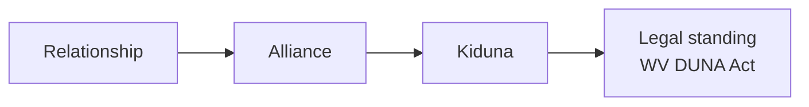

## Why this page is here

A Kiduna is built from a small number of distinct primitives that show up everywhere in the system: in the code, in the legal documents, in the user interface, and in everyday conversation about a Kiduna. Getting comfortable with them is the prerequisite for almost everything else in this documentation.

The primitives are not arbitrary categories. They are the smallest set of operating concepts that lets a member-governed institution coordinate humans, intelligent agents, and external partners without losing accountability. Each one carries a precise meaning in the system. The [Glossary](/reference/glossary) is the authoritative source for any conflict in usage.

## The resolution pattern

The single most important pattern in the stack is the chain of resolution that runs through every relationship:

Every relationship resolves to an Alliance. Every Alliance resolves to at least one Kiduna. Every Kiduna resolves to legal standing under the West Virginia DUNA Act.

This pattern is what makes the architecture work. A casual interaction between two Members can stay informal. A relationship that takes on shared scope, roles, or economics has matured into an Alliance, and gains a clear institutional home (the Kiduna it resolves to) and a clear legal standing through that home.

Without this pattern, coordination either stays trapped in private conversation or grows into something that resembles a partnership without anyone having signed up for that responsibility. Both outcomes have been studied closely. The first is familiar to anyone who has lost a friendship to a business deal. The second is the territory recent federal courts entered when they treated DAO members as general partners. The resolution pattern is how the Kiduna avoids both.

## Internal primitives

These describe people, agents, and structures inside the institution.

### Members

A Member is a participant in a Kiduna. Membership confers governance rights: the ability to propose, vote, hold roles, and have standing in the institution's records.

Members can be human or non-human. The DUNA statute does not restrict membership to natural persons, and the Kiduna design treats intelligent agents as eligible Members under conditions defined by the Kiduna's governing principles. This is a real shift from the platform era, where the entity behind every "user" was, by default, a single human, and the platform's rules were optimized around that assumption.

A note on terminology. When an intelligent agent is a Member in its own right, it is still called a Member. It is not called an Ally; Ally describes a different role (see below). The Glossary tracks this as an open question because some earlier materials used "non-human Member" and "Ally" interchangeably. The working canonical answer is that they are distinct: Members have governance rights, Allies have delegated authority and a Code.

### Allies

An Ally is a software actor — an agent — that represents a Member, Kiduna, Mission, or Alliance in relationship. The defining feature of an Ally is that it carries a [Kiduna Code](/builders/kiduna-codes): a signed, encrypted credential that binds it to a specific identity, scope, expiry, revocation status, lineage, and settlement context. An Ally without a valid Code is not yet an Ally; it is an unattributed program.

Allies are one of four agent types in the Kiduna stack. The other three — Performer, Envoy, and Program — are described on the [Agent types](/builders/agent-types) page. For most institutional purposes, Allies are the agent type that matters: they are the relational face of agentic action.

The reason Allies matter is direct. When a Member's Ally talks to a counterparty (a vendor, another Kiduna, a service provider), the counterparty needs to know whether the Ally has authority to act, what scope binds it, who is responsible if its action causes harm, and what happens when the Member wants to revoke it. A platform-era bot cannot answer those questions. An Ally can.

### Alliances

An Alliance is a coordinated relationship among Members, Allies, and institutions formed to pursue a defined activity. The activity can be a film, a benefit event, a neighborhood resilience project, a research cohort, a fan world, a family care plan, a spiritual retreat, a local food network, a political campaign, or any other endeavor that requires more than one person and more than one moment.

Alliances have shape. They define scope (what's in, what's out), roles (who does what), data access (who can see what), revenue splits (where economic value goes), milestones (what gets done by when), permissions (who can change what), dispute processes (what happens when something goes wrong), and termination rules (how it ends).

Every Alliance resolves to at least one Kiduna. The Kiduna is the legal home that gives the Alliance institutional standing — the place where the activity can hold property, enter contracts, and answer for itself.

A multi-Kiduna Alliance, in which Members from several Kidunas coordinate around a shared activity, is supported by the architecture. The canonical terminology for that case is still being decided; the Glossary tracks it as an open question.

### Vibes

A Vibe is the persistent relational environment in which Alliances live. A platform-era feed is an algorithmically curated stream of disconnected items. A Vibe is a continuous, member-aware surface where shared context accumulates, history is visible, and the present field of action is legible to the people and agents inside it.

Vibes are an interface concept rather than a content category. They aren't channels or groups. They are surfaces where the relational state of an Alliance (or a Kiduna, when the scope is the whole institution) is rendered in a way humans and agents can navigate together.

The pitch deck has used "Shared context" in one place where the rest of the material uses "Vibe." The working canonical term is Vibe. The pitch deck table will be brought into alignment.

### Missions

A Mission is the common nonprofit purpose around which a Kiduna is organized. The DUNA statute requires every DUNA to have one, and the Kiduna design treats the Mission as the durable orienting commitment of the institution: the thing every governance decision, every Alliance, and every Offering must answer to.

A Mission is operational. It scopes what Members can propose, what Allies can do, and what the treasury can spend on. It evolves only through enacted policy proposals. A short, evocative phrase can serve as a Mission's public name, but the Mission itself is the working definition of purpose that the institution can be held to.

## Economic primitives

These describe how value circulates inside and around a Kiduna.

### Offerings

An Offering is a transferable economic object. Goods, services, memberships, agents, digital or physical, one-time or subscription: anything a Kiduna or Member can give, sell, license, or exchange falls under this term.

Offerings carry provenance. When an Offering is created, traded, or used, the record of that activity travels with it through the [Kiduna Graph](/builders/graph). This is what makes attribution work. A Sponsor that supplies an Offering, a creator who authored it, a Member who recommended it, an Alliance that distributed it — each can be reflected in the Offering's history.

### Coins

A Coin is a token issued by a Kiduna and used by Members to participate in the Kiduna's economy. Members purchase Coins. Coins are spent on Membership fees, utility charges, and other Offerings.

The relationship between Coins and Offerings is straightforward in the common case (Members buy Coins, then spend Coins on Offerings) and more nuanced in edge cases (sponsorship arrangements, cross-Kiduna trades, governance markets). Detail lives on the [Treasury page](/founders/treasury) in For Founders.

The Glossary tracks an open question about whether "Coin" is the canonical type name or a generic category that includes per-Kiduna named tokens.

### Treasuries

A Treasury is a Kiduna's pool of assets, on-chain and off-chain, held under FROST threshold custody and spent only by Member vote. Every Kiduna has at least one Treasury. The Treasury is the institutional answer to questions about where money goes and who decides.

## External primitives

These describe how a Kiduna relates to entities outside its membership.

### Sponsors

A Sponsor is an external entity in contractual or economic relationship with a Kiduna or Alliance. Sponsors contribute economically through fees, in-kind support, services, distribution, or other arrangements. In exchange they receive benefits such as publicity, the right to sell specific Offerings, brand association, or domain positioning.

Sponsors are not Members. They participate through agreements rather than governance: no voting, no proposals, no Member roles. The relationship is contractual.

Sponsorship can attach to a Kiduna as a whole or to a specific Alliance under that Kiduna. The Glossary tracks the question of whether one term covers both cases, or whether the architecture warrants distinct terms ("Kiduna Sponsor" versus "Alliance Sponsor"). Detailed treatment of sponsorship lives in the [For Sponsors](/sponsors/overview) track.

## How the primitives compose

A worked example helps. Consider a small Kiduna organized around independent music criticism. Its Mission is to sustain rigorous, accountable music writing for the listening public.

The Kiduna has Members — writers, editors, readers who pay a Membership fee, and a handful of advisory figures. Some Members configure Allies: a writer's Ally helps draft and source citations under that writer's scope; an editor's Ally surfaces promising pitches and tracks deadlines.

Members form Alliances around specific projects. One Alliance is a long-running series on independent labels. It has scope (the editorial project), roles (lead writer, editor, fact-checker, publisher), data access (the writer can pull sales data the Alliance has licensed), and a revenue split (a portion goes to writers, a portion to the Kiduna treasury, a portion is set aside for next year's series).

The series lives in a Vibe — a persistent surface where the Alliance Members read drafts, react, deliberate, schedule, and settle. New writers entering the Vibe see history. Long-serving writers see continuity.

The Kiduna sells Offerings: a subscription to the writing, single-issue purchases, and a few limited-run print artifacts. A small audio gear retailer becomes a Sponsor of the Alliance, paying a sponsorship fee in exchange for non-display advertising in the print artifacts and the right to sell licensed merchandise through Kiduna Exchange. The arrangement is governed by a contract between the Kiduna (acting under its DUNA legal standing) and the retailer.

A piece in the series is later found to misrepresent a label's financial situation. A complaint comes in. The Alliance has a dispute process. The Kiduna has institutional records. The Ally that drafted the piece has lineage traceable to a specific Member. The complaint has somewhere to go. The Kiduna's governing principles describe how harm is reviewed and how repair is offered. The Sponsor is not implicated in the resolution — the editorial responsibility sits with the Alliance and the Kiduna, and the sponsorship agreement is not in breach.

Every layer of that example is composed from the primitives on this page. The substance of the work — music writing — is unique to this Kiduna. The structure is reusable.

## Open taxonomy questions

Filling out the rest of the documentation, and aligning code with the docs, depends on resolving the open questions surfaced above. They are tracked in the [Glossary](/reference/glossary):

1. Agent as umbrella term, Ally as one of four agent types. Working answer: yes.
2. Vibe or "Shared context" as canonical name. Working answer: Vibe.
3. Non-human Members and Allies treated as distinct (governance rights versus delegated authority). Working answer: distinct.
4. Cross-Kiduna Alliances. Open: same term, or new term.
5. Sponsor scope (per-Kiduna versus per-Alliance). Open: same term, or distinct terms.

Once these five are locked, the Glossary entries become final and the rest of the documentation, contracts, code, and external material can be brought into alignment.
